# 📦 A Minimal Blueprint for Trustless, Efficient Content Delivery

> A technical proof of concept to rethink content-addressable serving.

---

## ⚡ A New Angle: What If?

What if you could:

- `curl https://some-hash-stream-server.com/{cid}`
- Get **verifiable** data directly from any HTTP server
- Without trusting the server — only the **content** itself and the **place** where one got the hash
- Without needing resource-heavy stateful nodes, complex protocols, content discovery, or DHTs
- And still verifying every byte against its hash

**Hash Stream** is an exploration:  
**"How simple could content-addressable serving be, if we rethink it from first principles?"**

---

## 👤 The Operational Pain (and Hidden Assumptions)

In decentralized systems like IPFS, content addressing revolutionized how data is identified. But real-world operation revealed:

- Running full nodes at scale is **complex**, **costly**, **fragile**.
- Publishing and Consuming clients usually ship as a single product with very **tight coupling**, limiting scaling.
- "Content discovery" and "content verification" are **artificially tied together**.
- Some standards like UnixFS and CAR are considered as **the only way**, not just **one option**.

**Hash Stream** explores other alternatives.

---

## 📝 Going Back to the Whiteboard

### **What if... serving verifiable data was as easy as using `curl`?**

> 🚀 The origin story of Hash Stream:
> _“Can we make a server as simple as nginx — but for content-addressed data?”_

- Content-addressable requests over normal HTTP (or anything based on request/response)
- Smart reads from simple, trustless storage
- Verifiability built into the data flow, not bolted on

<p align="center">
  
</p>

---

### 🛫 Lifecycle of a Request

Let's walk through what happens internally.

> Please note that the implementations of each building block showed in the code snippets aim to show the simplicity of running this server.
> They are published in npm and available for using, but everyone is invited to make sure they are the best fit or write new implementations based on the specs and interfaces available.

#### 👷 Handle a Request

- Client sends `GET /cid`
- The server needs to find the bytes matching this CID by its [`multihash`](https://multiformats.io/multihash/) and stream them



---

#### 🌊 Stream Response to Client

- Server looks up for the bytes that can be cryptographically verified against the requested multihash, in its known storage
- Server creates a response to send back to the client, which is shaped by the client request:
  - a simple `multihash` request-response at a time interaction (similar to [Bitswap](https://specs.ipfs.tech/bitswap-protocol/))
  - more complex responses, such as [commp](https://spec.filecoin.io/systems/filecoin_files/piece/#section-systems.filecoin_files.piece), [blake3](https://github.com/BLAKE3-team/BLAKE3/), multiblock-responses ([CAR](https://ipld.io/specs/transport/car/carv1/)), etc.
- Stateless, low-memory footprint:
  - All `HashStreamer` building blocks are pure reads and streaming - ideal for tiny servers or Lambda Functions


```js
import { HashStreamer } from '@hash-stream/streamer'
import { IndexReader } from '@hash-stream/index/reader'
import { PackReader } from '@hash-stream/pack/reader'

const indexReader = new IndexReader(indexStore)
const packReader = new PackReader(packStore)
const hashStreamer = new HashStreamer(indexReader, packReader)

// Get verifiable blobs associated with the target multihash
for await (const { multihash, bytes } of hashStreamer.stream(targetMultihash)) {
  // TODO: Encode data stream to send to the client depending on the request
}

return new Response(dataStream)
```

---

#### 😎 Done — Trustless Data, Delivered!

Streamed bytes can be hashed by the client on the fly, in order to ensure they match the requested CID.

- Verified content, no server trust required
- Minimal moving parts
- Simple transport (HTTP, gRPC, etc.)


Client libraries like [`@helia/verified-fetch`](https://github.com/ipfs/helia-verified-fetch/tree/main/packages/verified-fetch) can help fetching and verifying responses easily.

```js
import { createVerifiedFetch } from '@helia/verified-fetch'

const verifiedFetch = await createVerifiedFetch({
  gateways: ['https://some-hash-stream-server.com'],
})

const response = await verifiedFetch(`ipfs://${cid}/`)
const data = await response.blob()
```

---

### 🛫 Lifecycle of the Response

> How does the streamer response actually get assembled?

#### 🕵️‍♂️ Find Index Records associated with the multihash

- No need to do "content discover" — just lookup for known Index records for the multihash



- **What’s an Index?**
  - A tiny, server-local, map of `multihash` → `IndexRecord`.
  - One can think of it like a `directory` or `map` for their content inside storage.
- There are different **fundamental lenses**, which an indexing system MAY be able to index and enable queries for:
  - A **Blob** is a set of bytes that is individually addressed by a multihash. It can be stored as is in a given store, or within a Pack.
  - A **Pack** holds several Blobs and is also individually addressed by a multihash. Multiple **Packs** MAY include the same Blob.
  - A **Containing** represents a set of Blobs/Packs that have some implied cryptographic relationship between them (e.g. a sharded DAG across multiple Packs/Blobs).

```typescript
type IndexRecordType = BLOB | PACK | CONTAINING
type BLOB = 0
type PACK = 1
type CONTAINING = 2

type IndexRecord = {
  // MultihashDigest identifiying the record
  multihash: MultihashDigest
  // Type of the record
  type: IndexRecordType
  // hash digest of the location (e.g. Pack multihash) or Path
  location: MultihashDigest | Path
  // length of the data
  length?: number
  // offset of the data in the location byte stream
  offset?: number
  // associated records
  subRecords: Array<IndexRecord>
}
```

```js
import { IndexReader } from '@hash-stream/index/reader'
import { S3LikeIndexStore } from '@hash-stream/index/store/s3-like'

const indexStore = new S3LikeIndexStore() // TODO: Create store with s3 client
const indexReader = new IndexReader(indexStore)

for await (const indexRecord of indexReader.findRecords(targetMultihash)) {
  // TODO: process the index Records to fetch the bytes
}
```

---

#### 📦 Read Blobs from Pack Storage

- Once the index records are found, the bytes can be read from the storage layer
- The blob location can be obtained from the records and passed to a Pack Reader.
  - The location can either be a simple `location` Multihash representing a Pack multihash, or some blob ranges within this `location` specified as an array of `{ length, range, multihash }`, where multihash represents the hash of the bytes to be read in each range.
- The server may fetch the right byte ranges from a Pack (e.g., [CAR](https://ipld.io/specs/transport/car/carv1/) file)



```js
import { PackReader } from '@hash-stream/pack/reader'
import { S3LikePackStore } from '@hash-stream/pack/store/s3-like'

const packStore = new S3LikePackStore() // TODO: Create store with s3 client
const packReader = new PackReader(packStore)

for await (const { multihash, bytes } of this.packReader.stream(
  // Pack multihash
  locationMultihash,
  // Read full pack if no ranges, or just ranges of the pack
  blobRanges // [{ offset: 0, length: 1000, multihash: Uint8Array }]
)) {
  // TODO: stream it to the client - each chunk can be verified as it goes
}
```

---

#### 🌊 Stream Response to Client

- Streamer ties together the previous steps by finding index records and reading packs (byte ranges).



---

## 🧪 Architecture: Simple and Modular

- Hash Stream separates the system into modular building blocks that act together to serve some requested content:



---

### 🫀 Core Components

- **HashStreamer:** coordinates the trustless flow.
- **IndexReader:** finds where bytes associated with a given multihash are stored based on stored Index Records.
- **PackReader:** retrieves raw bytes from storage.
- **Stores:** pluggable (filesystem, S3, R2, etc.).

---

### 🧩 Pluggable blocks and Interfaces

- Each piece is **replaceable**, **pluggable** and **optional**.
- **Clear interfaces** and test suites available to facilitate building own stores/readers/writers.
- Any storage backend: S3, R2, FS, custom APIs.
- Any index or pack implementation: bring your own formats or extend the ones available.

> Implement the interface, ready to plug and play.

---

## ✨ Hypotheses Explored in this Proof of Concept

- ✅ Reads and writes can be **fully independent**.
- ✅ Content discovery and content addressing are **separable**.
- ✅ Content verification can be **simple** and **efficient**.
- ✅ UnixFS and CAR are **optional** patterns, not requirements.
- ✅ Existing data can be made content-addressable by **combining it with lightweight indexes and verification** (e.g., bao trees, detached UnixFS), without copying or rewriting the original files.
- ✅ Servers can stay **lightweight** and **stateless**, and be **easily** deployed across different environments.

---

## 📆 Deploy

Hash Stream is thought for simple **READ-SIDE deployments**:

- Stateless, horizontally scalable HTTP servers.
- Store packs and indexes in any backend (FS, S3, R2, etc).
- Deploy to:
  - Bare metal
  - Cloud VMs
  - AWS Lambda
  - Cloudflare Workers
  - Docker / Kubernetes

Minimal assumptions. Maximum flexibility.

---

## 🖼️ Example: Trustless IPFS Gateway implementations PoC

- [Node.js Server using HashStream Filesystem based building blocks](https://github.com/vasco-santos/hash-stream-infra-poc-server)
- [Cloudflare Workers deployment using HashStream cloud storage building blocks](https://github.com/vasco-santos/hash-stream-infra-poc-cf)

---

## 🔗 Bring Your Own Data / Storage

One can use Hash Stream whether they already have content-addressable data or not:

- **Own Packs + Own Indexes**
  - ✅ Deploy Hash Streamer directly and create simple adapters to match Hash Stream interfaces for PackReader and IndexReader.
- **Own Packs Only (No Indexes)**
  - ✅ Use Hash Stream's indexing toolkit to generate lightweight indexes for your data.
- **Raw Data**
  - ✅ Use indexing pipeline to generate indexes that point directly to raw data at rest without data transformation. See [Bring Own Storage Guide](https://vasco-santos.github.io/hash-stream/guides/bring-own-storage/) and the [Index Pipeline PoC](https://vasco-santos.github.io/hash-stream/pocs/index-pipeline/).
  - As a more expensive alternative, use Pack Toolkit to transform into Packs, and Index Toolkit to generate indexes (they MAY be used together for optimized processing). This 

| Starting Point  | Needed Action             |
| --------------- | ------------------------- |
| Packs + Indexes | Deploy Streamer           |
| Packs Only      | Index with CLI or library |
| Raw Data        | Run Indexing Pipeline     |

Storage backends are **pluggable**—use local filesystem, S3, R2, or build your own!

---

### 🔄 Write Toolkit: Ingesting and Indexing

- **PackWriter**: Transform raw files into verifiable packs.
- **IndexWriter**: Create efficient multihash indexes for lookup.
- **CLI Tools**: Ingest data manually or build automated pipelines.

> Writes are _optional_: You can use your existing content-addressable data, or use Hash Stream's tooling if you don't have any, or just build side indexes that do not require data transformation.

CLI Commands:

```bash
# Transform a file into a CAR pack
hash-stream pack write ./my-file.txt --index-writer multiple-level

# Add an index for a CAR pack
hash-stream index add <packCID> ./my-file.car
```

Or use the libraries directly inside ingestion pipelines.

---

## 🔍 Why This Matters

This minimal blueprint aims to:

- Serving verifiable content becomes **simple**.
- Heavy infrastructure becomes **optional**.
- Discovery and delivery are cleanly separated.
- Content addressing becomes a **deployment pattern**, not a protocol lock-in.
- Retroactive content addressability on existing data.

**Hash Stream** is a foundation. It’s a conceptual exploration for builders, researchers, and systems architects. Feel free to fork it, extend it, replace pieces, or build production-ready systems based on these ideas.

_Let's explore it, extend it, and build better systems together._

# ✨ Explore Hash Stream Today

- [GitHub Repository](https://github.com/vasco-santos/hash-stream)
- [Draft Specifications](https://github.com/vasco-santos/hash-stream/tree/main/specs)
