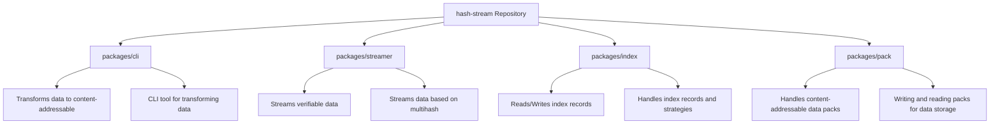
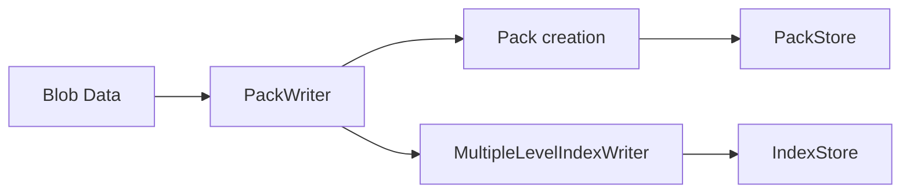
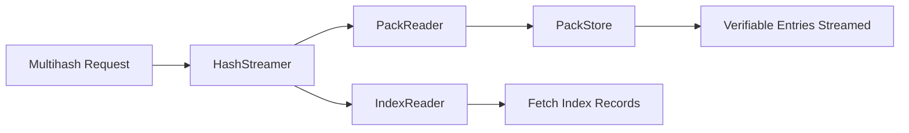
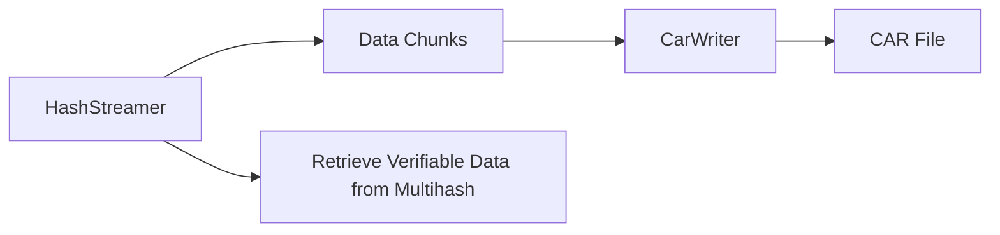

<p align="center">
  
</p>

<h1 align="center">Building blocks for running a off-the-shelf trustless HTTP server for content-addressable data.</h1>

## Table of Contents

- [Getting Started](#getting-started)
- [Requirements](#requirements)
- [Packages](#packages)
- [Usage](#usage)
- [Contributing](#contributing)
- [License](#license)

## Getting Started

This repository provides a set of libraries and tools that allow you to build and run a trustless HTTP server for content-addressable data. These building blocks are modular and designed in a plug-and-play fashion, enabling you to use just a subset of them to create a custom server. Going through the [Blueprint](./BLUEPRINT.md) document is a great way to better understand Hashstream.

For those interested in implementing building blocks differently, there are a few [specifications](./specs/) and interfaces available, allowing new implementations to be compatible with the existing pieces.

Documentation generated from types can be seen at [https://vasco-santos.github.io/hash-stream](https://vasco-santos.github.io/hash-stream).

## Development

### Installing

To work on this codebase **you need**:

- Node.js >= v18
- Install the deps with `pnpm i`

### Testing

For testing environment, first install [Docker Desktop](https://www.docker.com/) and ensure it is running. This codebase has `S3 client compatible` backed datastores used in testing, which are simulated using Docker.

Next, ensure the `AWS_REGION`, `AWS_ACCESS_KEY_ID` and `AWS_SECRET_ACCESS_KEY` environment variables are set in your terminal. They do
not need to be set to real values - the following works in `bash`-like shells:

```
export AWS_REGION='us-west-2'; export AWS_ACCESS_KEY_ID='NOSUCH'; export AWS_SECRET_ACCESS_KEY='NOSUCH'
```

## Packages

The repository includes the following packages:

- [`packages/cli`](./packages/cli/): A CLI tool for transforming data into content-addressable data, writing index records, and a verifiable streamer.
- [`packages/streamer`](./packages/streamer/): A library for streaming verifiable data associated with a requested multihash, based on available index records and stored packs.
- [`packages/index`](./packages/index/): A library with implementations for `IndexReader` and various `IndexWriter` strategies, along with `IndexStore` implementations.
- [`packages/pack`](./packages/pack/): A library for writing data into packs (`PackWriter`) and reading them back (`PackReader`), facilitating the creation and retrieval of content-addressable data. While writing data into packs, Index Records can be created when provided an `IndexWriter` implementation.
- [`packages/utils`](./packages/utils/): Utility functions for working with [hash-stream](https://github.com/vasco-santos/hash-stream), including converting verifiable blob streams to CAR files or raw bytes and building HTTP responses with appropriate content headers.



## Usage

Here follow two simple examples relying on the building blocks of `hash-stream`.

The first example relies on the available building blocks to ingest some data to a configured Store and have it indexed.

```js
import fs from 'fs'
import { Readable } from 'stream'
import { base58btc } from 'multiformats/bases/base58'

import { PackWriter } from '@hash-stream/pack'

// Example using MultipleLevelIndexWriter implementation
import { MultipleLevelIndexWriter } from '@hash-stream/index/writer/multiple-level'

// Example using File System stores implementation
import { FSIndexStore } from '@hash-stream/index/store/fs'
import { FSPackStore } from '@hash-stream/pack/store/fs'

async function main() {
  // Initialize the stores
  const indexStore = new FSIndexStore('/path/to/index-store')
  const packStore = new FSPackStore('/path/to/pack-store')

  // Initialize the index writer
  const indexWriter = new MultipleLevelIndexWriter(indexStore)

  // Initialize the pack writer with the store and an index writer to write
  // index record when blobs are added
  const packWriter = new PackWriter(packStore, {
    indexWriter,
  })

  // Get a data blob
  const filePath = 'path/to/your/file.mov'
  const fileStream = fs.createReadStream(filePath)

  // Blob-like data here refers to any data that can be transformed into a streamable format
  const blobLike = {
    stream: () => Readable.toWeb(fileStream),
  }

  // Write Blob as packs
  const { containingMultihash, packsMultihashes } = await packWriter.write(
    blob,
    {
      type: 'car',
      // sharding Data Blob into multiple packs for efficient storage, retrieval and verifiability
      shardSize: 10_000_000,
    }
  )

  // Iterate through the created packs representing the entire data blob
  // Each pack is individually represented by a multihash of its bytes.
  for (const packMultihash of packsMultihashes) {
    console.log(
      'Pack multihash (base58btc):',
      base58btc.encode(packMultihash.bytes)
    )
  }

  // Multihash representing a cryptographic relationship of all the packs
  // or the multihash who represents the entire Blob like data packed.
  const containingMultihash = await containingPromise
  console.log(
    'Containing multihash (base58btc):',
    base58btc.encode(containingMultihash.bytes)
  )
}

main().catch(console.error)
```



Note that `PackWriter` in example above is used to write transformed data into the `PackStore`. For use cases where data does not need to be transformed to content addressable data, an `IndexWriter` can be used to simply write index records from a given Blob like data.

The next example relies on the used `PackStore` and `Index Records` written to have a verifiable stream of data provided. The `hashStreamer` is an abstraction layer that relies on the `IndexReader` and the `PackReader` to stream verifiable entries associated with the target multihash. The implementor can decide to simply use the `IndexReader` and the `PackReader` to have more control over the stream behaviour.

```js
import { HashStreamer } from '@hash-stream/streamer'

// Readers implementations
import { IndexReader } from '@hash-stream/index/reader'
import { PackReader } from '@hash-stream/pack'

// Example using File System stores implementation
import { FSIndexStore } from '@hash-stream/index/store/fs'
import { FSPackStore } from '@hash-stream/pack/store/fs'

async function main() {
  // Initialize the stores
  const indexStore = new FSIndexStore('/path/to/index-store')
  const packStore = new FSPackStore('/path/to/pack-store')

  // Initialize the readers
  const indexReader = new IndexReader(indexStore)
  const packReader = new PackReader(packStore)

  // Initialize the streamer
  const hashStreamer = new HashStreamer(indexReader, packReader)

  // Set the target multihash you want to retrieve
  const targetMultihash = // TODO

  // Set the containing multihash (optional, can be null or undefined)
  // It serves as an extra HINT for where target MAY be found
  const containingMultihash = // TODO

  // Iterate over the verifiable entries to verifiably reconstruct
  // original blob like data
  for await (const { multihash, bytes } of hashStreamer.stream(
    targetMultihash,
    { containingMultihash }
  )) {
    // TODO
    // Handle each entry in the stream here
    // You can process or store `multihash` and `bytes` as needed
    console.log('Multihash:', base58btc.encode(multihash.bytes))
    console.log('Data bytes:', bytes)
  }
}

main().catch(console.error)
```



One of the typical ways to transport the verifiable entries is via CAR files. A [CarWriter](https://github.com/ipld/js-car?tab=readme-ov-file#CarWriter) may be used to write the content of the stream into.

```js
import { CarWriter } from '@ipld/car'

// Example usage to write verifiable entries to a CAR file
const writer = CarWriter.create()

for await (const { multihash, bytes } of hashStreamer.stream(targetMultihash, {
  containingMultihash,
})) {
  // Write each chunk to the CAR file
  writer.put(multihash, bytes)
}

// Finalize and get the CAR file
const carFile = await writer.close()
console.log('CAR file created:', carFile)
```



## Deployment

A Deployment Guide is available [here](./DEPLOYMENT_GUIDE.md).

## Resources

- [Hashstream demo video](https://youtu.be/rFjz6n_UGaY)

## Contributing

All welcome! `hash-stream` is open-source. See the [contributing guide](./CONTRIBUTING.md)

This project uses node v18 and `pnpm`. It's a monorepo that uses [pnpm workspaces](https://pnpm.io/workspaces) to handle resolving dependencies between the local [`packages`](https://github.com/vasco-santos/hash-stream/tree/main/packages)

## License

Dual-licensed under [MIT + Apache 2.0](license.md)
