Hash Stream demonstrates a scalable and efficient approach to bring-your-own-data content addressing. Its composable building blocks make it easy to deploy across environments—whether you're running local scripts or building on top of cloud-native infrastructure.

One can find an [AWS backed Index Pipeline to bring own bucket store](/hash-stream/pocs/aws-index-pipeline) and a [Node.js Index Pipeline to bring own FS store](/hash-stream/pocs/node.js-index-pipeline) PoC on an implementation on this

## Introduction

**Hash Stream** enables serving data as content-addressable without requiring data transformation or duplication. Whether you already have content-addressable data and indexes or are working with raw files, Hash Stream provides modular building blocks to enable verifiable, efficient delivery for these.

Traditionally, serving content-addressable data involves costly and complex transformations for data at rest. Hash Stream supports using detached indexes that map CIDs to byte ranges within existing file to avoid that. These indexes allow servers to serve data in a content addressable way without requiring the content provider to restructure or re-upload their data.

Currently, UnixFS is the only supported format, but other formats (e.g., Blake3) can be supported with minimal effort. All components in the system are modular—providers can swap or extend them to better suit provider needs or infrastructure.

## 🧩 Index Pipeline Architecture

The following architecture outlines a pipeline to generate indexes from files stored in a file store. The pipeline lists raw files, schedules them for indexing, and a file processer generates detached indexes that map content to byte ranges.

> Note: When using UnixFS, a root block must be created and stored separately. This enables clients to reconstruct the UnixFS DAG when requesting the root CID, while still allowing retrieval by individual leaf CIDs.



### Minimal Local Example

```js
import {
  scheduleStoreFilesForIndexing,
  processFileForIndexing
} from '@hash-stream/index-pipeline/index'
import all from 'it-all'

// Example implementations in Memory
import { MemoryFileStore } from '@hash-stream/index-pipeline/file-store/memory'
import { MemoryIndexScheduler } from '@hash-stream/index-pipeline/index-scheduler/memory'
import { MemoryPackStore } from '@hash-stream/pack/store/memory'

const fileStore = new MemoryFileStore([...])
const scheduler = new MemoryIndexScheduler([])
const packStoreWriter = new MemoryPackStore()
const indexWriters = [...] // Select appropriate writer(s) from @hash-stream/index

// Schedule all files for indexing
await all(scheduleStoreFilesForIndexing(fileStore, scheduler))

// Consume and process tasks
for await (const task of scheduler.drain()) {
  await processFileForIndexing(fileStore, packStoreWriter, indexWriters, 'unixfs', task.fileReference)
}
```

For cloud deployments, see the [AWS-backed Index Pipeline PoC](/hash-stream/pocs/aws-index-pipeline) PoC.

The `@hash-stream/utils` package provides utility functions for building detached indexes for UnixFS in case one need more low level support to build a building block.

## ☁️ Hash Stream Server Architecture

When working with detached indexes (specially UnixFS) and raw files, the Hash Stream server needs access to both the file storage and the stored root blocks.

The "default" implementation of the HashStream Server uses a `PackReader`, which only has access to the Pack Store. In this case the HashStream server not only needs to access the PackStore where the UnixFS Root blocks get stored, but also the FileStore where the raw files are stored. Therefore, a `UnixFsPackReader` building block is also provided to facilitate this.

The following diagram illustrates a potential architecture for a Hash Stream Server. It reads paths from the indexes via the `FileStore` and multihashes for the UnixFS Root Block via the `PackStore`. This enables an ingestion pipeline to be Content Addressable and directly to the PackStore underlying storage if desired.


### Minimal Server Example

```js
// Streamer
import { HashStreamer } from '@hash-stream/streamer'

// Index
import { IndexReader } from '@hash-stream/index/reader'
import { S3LikeIndexStore } from '@hash-stream/index/store/s3-like'

// Pack
import { UnixFsPackReader } from '@hash-stream/utils/index/unixfs-pack-reader'
import { S3LikePackStore } from '@hash-stream/pack/store/s3-like'

const s3Client = new S3Client()

const indexStore = new S3LikeIndexStore({
  bucketName: Resource.IndexStoreBucket.name as any,
  prefix: '', // Use empty prefix to access the root of the bucket
  client: s3Client,
})

const packStore = new S3LikePackStore({
  bucketName: Resource.PackStoreBucket.name as any,
  prefix: '', // Use empty prefix to access the root of the bucket
  client: s3Client,
  extension: '' // Use empty extension to access files without a specific extension as the location already includes this
})

const pathStore = new S3LikePackStore({
  bucketName: Resource.FileStoreBucket.name as string,
  prefix: '', // Use empty prefix to access the root of the bucket
  client: s3Client,
  extension: '' // Use empty extension to access files without a specific extension as the location already includes this
})

const indexReader = new IndexReader(indexStore)
const packReader = new UnixFsPackReader(packStore, pathStore)

return new HashStreamer(indexReader, packReader)
```

For cloud deployments, see the [AWS-backed Index Pipeline PoC](/hash-stream/pocs/aws-index-pipeline) PoC, which also includes for demo purposes a Hash Stream Server.