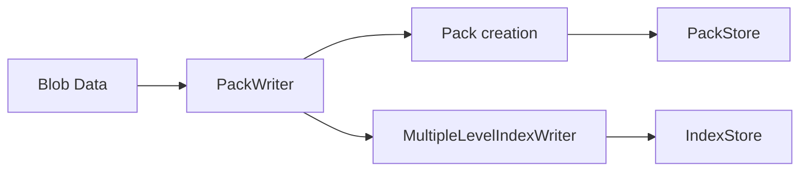
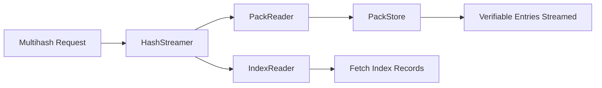
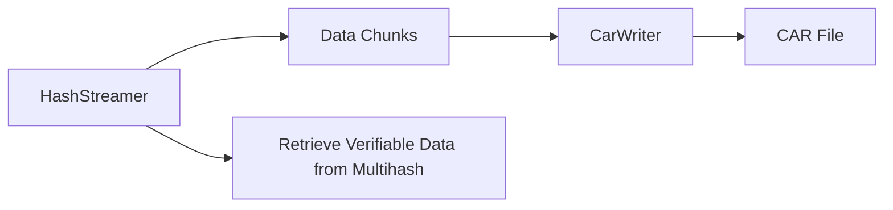

Here follow two simple examples relying on the building blocks of `hash-stream`.

The first example relies on the available building blocks to ingest some data to a configured Store and have it indexed.

```js
import fs from 'fs'
import { Readable } from 'stream'
import { base58btc } from 'multiformats/bases/base58'

import { PackWriter } from '@hash-stream/pack'

// Example using MultipleLevelIndexWriter implementation
import { MultipleLevelIndexWriter } from '@hash-stream/index/writer/multiple-level'

// Example using File System stores implementation
import { FSIndexStore } from '@hash-stream/index/store/fs'
import { FSPackStore } from '@hash-stream/pack/store/fs'

async function main() {
  // Initialize the stores
  const indexStore = new FSIndexStore('/path/to/index-store')
  const packStore = new FSPackStore('/path/to/pack-store')

  // Initialize the index writer
  const indexWriter = new MultipleLevelIndexWriter(indexStore)

  // Initialize the pack writer with the store and an index writer to write
  // index record when blobs are added
  const packWriter = new PackWriter(packStore, {
    indexWriter,
  })

  // Get a data blob
  const filePath = 'path/to/your/file.mov'
  const fileStream = fs.createReadStream(filePath)

  // Blob-like data here refers to any data that can be transformed into a streamable format
  const blobLike = {
    stream: () => Readable.toWeb(fileStream),
  }

  // Write Blob as packs
  const { containingMultihash, packsMultihashes } = await packWriter.write(
    blob,
    {
      type: 'car',
      // sharding Data Blob into multiple packs for efficient storage, retrieval and verifiability
      shardSize: 10_000_000,
    }
  )

  // Iterate through the created packs representing the entire data blob
  // Each pack is individually represented by a multihash of its bytes.
  for (const packMultihash of packsMultihashes) {
    console.log(
      'Pack multihash (base58btc):',
      base58btc.encode(packMultihash.bytes)
    )
  }

  // Multihash representing a cryptographic relationship of all the packs
  // or the multihash who represents the entire Blob like data packed.
  const containingMultihash = await containingPromise
  console.log(
    'Containing multihash (base58btc):',
    base58btc.encode(containingMultihash.bytes)
  )
}

main().catch(console.error)
```



Note that `PackWriter` in example above is used to write transformed data into the `PackStore`. For use cases where data does not need to be transformed to content addressable data, an `IndexWriter` can be used to simply write index records from a given Blob like data.

The next example relies on the used `PackStore` and `Index Records` written to have a verifiable stream of data provided. The `hashStreamer` is an abstraction layer that relies on the `IndexReader` and the `PackReader` to stream verifiable entries associated with the target multihash. The implementor can decide to simply use the `IndexReader` and the `PackReader` to have more control over the stream behaviour.

```js
import { HashStreamer } from '@hash-stream/streamer'

// Readers implementations
import { IndexReader } from '@hash-stream/index/reader'
import { PackReader } from '@hash-stream/pack'

// Example using File System stores implementation
import { FSIndexStore } from '@hash-stream/index/store/fs'
import { FSPackStore } from '@hash-stream/pack/store/fs'

async function main() {
  // Initialize the stores
  const indexStore = new FSIndexStore('/path/to/index-store')
  const packStore = new FSPackStore('/path/to/pack-store')

  // Initialize the readers
  const indexReader = new IndexReader(indexStore)
  const packReader = new PackReader(packStore)

  // Initialize the streamer
  const hashStreamer = new HashStreamer(indexReader, packReader)

  // Set the target multihash you want to retrieve
  const targetMultihash = // TODO

  // Set the containing multihash (optional, can be null or undefined)
  // It serves as an extra HINT for where target MAY be found
  const containingMultihash = // TODO

  // Iterate over the verifiable entries to verifiably reconstruct
  // original blob like data
  for await (const { multihash, bytes } of hashStreamer.stream(
    targetMultihash,
    { containingMultihash }
  )) {
    // TODO
    // Handle each entry in the stream here
    // You can process or store `multihash` and `bytes` as needed
    console.log('Multihash:', base58btc.encode(multihash.bytes))
    console.log('Data bytes:', bytes)
  }
}

main().catch(console.error)
```



One of the typical ways to transport the verifiable entries is via CAR files. A [CarWriter](https://github.com/ipld/js-car?tab=readme-ov-file#CarWriter) may be used to write the content of the stream into.

```js
import { CarWriter } from '@ipld/car'

// Example usage to write verifiable entries to a CAR file
const writer = CarWriter.create()

for await (const { multihash, bytes } of hashStreamer.stream(targetMultihash, {
  containingMultihash,
})) {
  // Write each chunk to the CAR file
  writer.put(multihash, bytes)
}

// Finalize and get the CAR file
const carFile = await writer.close()
console.log('CAR file created:', carFile)
```


