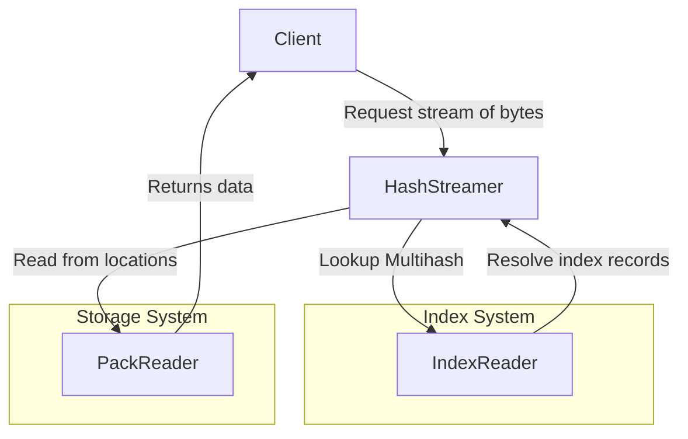

## Editors

- [Vasco Santos](https://github.com/vasco-santos)

## Authors

- [Vasco Santos](https://github.com/vasco-santos)

# Abstract

This document describes an indexing protocol that enables content-addressable data to be served efficiently by a server with access to stored verifiable packs and indexes.

## Language

The key words "MUST", "MUST NOT", "REQUIRED", "SHALL", "SHALL NOT", "SHOULD", "SHOULD NOT", "RECOMMENDED", "MAY", and "OPTIONAL" in this document are to be interpreted as described in [RFC2119](https://datatracker.ietf.org/doc/html/rfc2119).

# Overview

Smart client implementations MAY request a verifiable pack as a single verifiable blob (e.g. RAW) or as a verifiable pack of blobs (e.g., [CAR[(https://ipld.io/specs/transport/car/)]). The server relies on indexes that enable it to handle requests efficiently. This specification cover the index primitives to enable verifiable content retrievability.

## Fundamentals

There are three different **fundamental lenses**, which the indexing system MAY be able to index and enable queries for:

- A **Blob** is a set of bytes that is individually addressed by a multihash. It can be stored as is in a given store, or within a Pack.
- A **Pack** holds several Blobs and is also individually addressed by a multihash (can be seen as a Blob itself). Multiple **Packs** MAY store the same Blob.
- A **Containing** represents a set of Blobs/Packs. It can be individually addressed by a multihash and implies some cryptographic relationship.

## Design Principles

The design of the indexing system considers the following key aspects:

### Modular & Pluggable Indexing:

- The protocol supports multiple indexing strategies based on different trade-offs.
- Implementations can choose the best index type depending on cost, performance, and use case.
- Supports integrating new indexing mechanisms without requiring changes to the core protocol.

### Storage Efficiency & Cost Optimization:

- The protocol aims to minimize storage and retrieval costs by leveraging compact and structured index formats.

## System Design

The indexer system can be decoupled into a set of key components:

### Index Record

An index record has the necessary metadata to find the location where the bytes behind a given `MultihashDigest` rest. It can be represented as follows:

```ts
import { MultihashDigest } from 'multiformats'

type IndexRecord = {
  // MultihashDigest identifiying the record
  multihash: MultihashDigest
  // Type of the record
  type: IndexRecordType
  // hash digest of the location or Path
  location: MultihashDigest | Path
  // length of the data
  length?: number
  // offset of the data in the location byte stream
  offset?: number
  // associated records
  subRecords: Array<IndexRecord>
}

// Record Type Enum
type IndexRecordType = BLOB | PACK | CONTAINING
type BLOB = 0
type PACK = 1
type CONTAINING = 2

type Path = string
```

### Index Store Reader

Index records can be read from a given store based on the following Reader interface.

```ts
import { MultihashDigest } from 'multiformats'

interface IndexStoreReader {
  get(hash: MultihashDigest): AsyncIterable<IndexRecord>
}
```

### Index Reader Interface

The index reader MUST support finding locations where given multihashes are stored.

```ts
import { MultihashDigest } from 'multiformats'

interface IndexReader {
  // Stores indexed entries
  store: IndexStore

  // Find the index records related to the requested multihash
  findRecords(
    multihash: MultihashDigest,
    // similar to https://github.com/ipfs/specs/pull/462
    options?: { containingMultihash?: MultihashDigest }
  ): AsyncIterable<IndexRecord>
}
```

## Relationship Between Components

**Reading Previously Indexed Data**

1. A client requests a stream of bytes behind a given multihash using a Hash Streamer.
2. The Hash Streamer queries the appropriate Index.
3. The Index Reader provides index records representing the location where requested multihash bytes are stored.
4. The Hash Streamer fetches the actual data based on the resolved locations (see `hash-streamer.md`).


