<p align="center">
  
</p>

<h1 align="center">Pipeline for creating indexes for raw data at rest</h1>

## Install

```sh
npm install @hash-stream/index-pipeline
```

## Overview

`@hash-stream/index-pipeline` provides a modular pipeline for indexing files in a content-addressable way. It consists of interfaces and implementations for reading files from a store, scheduling indexing tasks, and processing files into indexes.

This package is ideal for cloud or local workflows that:

* need to **scan large object stores** or filesystems
* **schedule files for processing** (e.g., via a queue)
* **generate content-addressed indexes** (e.g., UnixFS link indexes) without data transformation

---

## Architecture



## Usage

```js
import {
  scheduleStoreFilesForIndexing,
  processFileForIndexing
} from '@hash-stream/index-pipeline/index'
import all from 'it-all'

// Example implementations
import { MemoryFileStore } from '@hash-stream/index-pipeline/file-store/memory'
import { MemoryIndexScheduler } from '@hash-stream/index-pipeline/index-scheduler/memory'
import { MemoryPackStore } from '@hash-stream/pack/store/memory'

const fileStore = new MemoryFileStore([...])
const scheduler = new MemoryIndexScheduler([])
const packStoreWriter = new MemoryPackStore()
// See @hash-stream/index package to select a writer
const indexWriters = [...]

// Schedule all files for indexing
await all(scheduleStoreFilesForIndexing(fileStore, scheduler))

// Consume and process tasks
for await (const task of scheduler.drain()) {
  await processFileForIndexing(fileStore, packStoreWriter, indexWriters, 'unixfs', task.fileReference)
}
```

It is worth noting that `@hash-stream/utils` package exports a `UnixFsPackReader` implementation, which MAY be the desired implementation of a HashStream server after running this pipeline. This is useful for keeping original raw files in a separate store and UnixFS Dag files in another store.

---

## API

### `scheduleStoreFilesForIndexing(fileStore, indexScheduler, options?)`

Lists all files from a `FileStore` and schedules them via an `IndexScheduler`.

* `fileStore`: an object implementing `FileStore`
* `indexScheduler`: an object implementing `IndexScheduler`
* `options.format`: index format (defaults to `'unixfs'`)

Returns:

* `AsyncIterable<string>` with files scheduled for indexing

### `processFileForIndexing(fileStore, indexWriters, indexFormat, fileReference, options?)`

Scheduler consumer function where a file reference is fetched from the store, processed, and then written
to the index store. Depending on the index format (for example the DAG in UnixFS) more information may be stored using the `packStoreWriter`.

* `fileStore`: an object implementing `FileStore`
* `packStoreWriter`: an object implementing `PackStoreWriter`
* `indexWriters`: an array of objects implementing `IndexWriter`
* `indexFormat`: string (e.g., `'unixfs'`)
* `fileReference`: string reference to the file in the file store
* `options`: optional `ProcessFileForIndexingOptions`

Returns:

* `Promise<MultihashDigest>` containing multihash of the indexed data

---

## Interfaces

### FileStore

```ts
interface FileStore {
  list(): AsyncIterable<FileMetadata>
  get(fileReference: string): Promise<BlobLike | null>
}
```

### IndexScheduler

```ts
interface IndexScheduler {
  add(fileReference: string, options?: IndexSchedulerAddOptions): Promise<void>
}
```

### IndexWriter

The `IndexWriter` interface is defined in `@hash-stream/index/types`. It is used to write generated index data.

---

## Provided Implementations

### FileStore

| Import Path                   | Description                           |
| ----------------------------- | ------------------------------------- |
| `file-store/memory`           | In-memory file store                  |
| `file-store/fs`               | Filesystem-backed file store          |
| `file-store/s3-like`          | S3-compatible object store (e.g., R2) |
| `file-store/cf-worker-bucket` | Cloudflare Worker-compatible store    |

### IndexScheduler

| Import Path              | Description                             |
| ------------------------ | --------------------------------------- |
| `index-scheduler/memory` | In-memory scheduler (local dev/testing) |
| `index-scheduler/sqs`    | AWS SQS-backed scheduler                |

You can mix and match any implementation of `FileStore` and `IndexScheduler`.

---

## Testing Utilities

The package exports reusable test suites to validate your own `FileStore` or `IndexScheduler` implementations:

```ts
import { runFileStoreTests, runIndexSchedulerTests } from '@hash-stream/index-pipeline/test'
```

You can use these to ensure your custom implementations behave correctly.

---

## Custom Implementations

You can provide your own implementations by adhering to the exported interfaces. Here is an example:

#### Example: Implementing a Custom File Store

```ts
import { FileStore } from '@hash-stream/index-pipeline/types'

class MyCustomStore implements FileStore {
  async *list() {
    yield { key: 'file1.txt', size: 1234 }
  }

  async get(fileReference) {
    return new Blob(['hello world'])
  }
}
```

---

## Contributing

Feel free to join in. All welcome. Please [open an issue](https://github.com/vasco-santos/hash-stream/issues)!

## License

Dual-licensed under [MIT + Apache 2.0](https://github.com/vasco-santos/hash-stream/blob/main/license.md)
