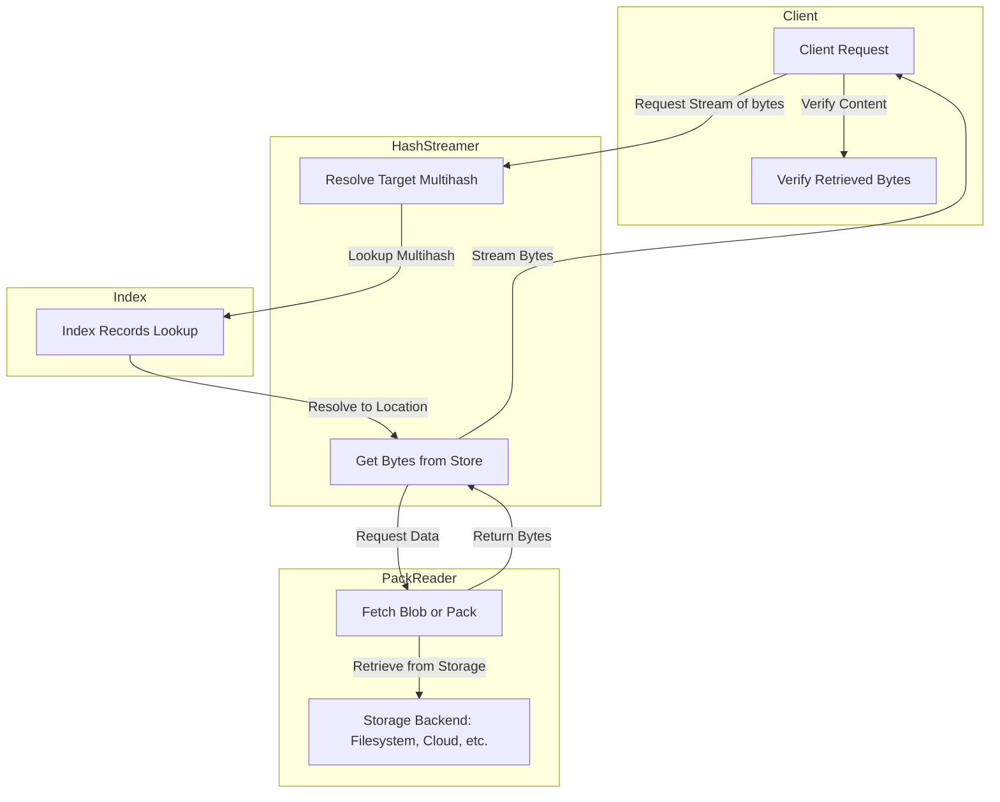

# Hash Streamer Specification


## Editors

- [Vasco Santos](https://github.com/vasco-santos)

## Authors

- [Vasco Santos](https://github.com/vasco-santos)

# Abstract

This document describes the Hash Streamer, a system responsible for enabling efficiently retrieving and verifying cryptographically verifiable data.

## Language

The key words "MUST", "MUST NOT", "REQUIRED", "SHALL", "SHALL NOT", "SHOULD", "SHOULD NOT", "RECOMMENDED", "MAY", and "OPTIONAL" in this document are to be interpreted as described in [RFC2119](https://datatracker.ietf.org/doc/html/rfc2119).

# Overview

The Hash Streamer enables consumers to read a stream of bytes that can be cryptographically verified against the requested multihash (target multihash). It relies on an indexing layer, defined in the [Index Specification](./index.md), to determine the location of the target data within a given **PackStore** (MAY be spread in multiple location). These bytes can represent a **Blob**, a **Pack**, or a **Containing** cryptographic reference.

## Design Principles

- **Trustless verification**: Ensures clients can independently verify retrieved bytes.
- **Efficient storage access**: Optimized for speed and storage cost.

## Interfaces

### Hash Streamer Interface

```ts
import { MultihashDigest } from 'multiformats'

interface HashStreamer {
  // Index lookup interface, as defined in the Index Specification
  indexReader: IndexReader

  // Pack retrieval interface, as defined in the Pack Specification
  packReader: PackReader

  // Retrieve a stream of verifiable blobs composing the target multihash
  stream(
    targetMultihash: MultihashDigest,
    options?: { containingMultihash?: MultihashDigest }
  ): AsyncIterable<VerifiableBlob>
}

type VerifiableBlob = {
  multihash: Multihash
  bytes: Uint8Array
  type: PLAIN
}

type PLAIN = 0
```

## Relationship Between Components

The **Hash Streamer**, **Index**, and **Pack Reader** work together to enable efficient and structured data retrieval:

1. **Index Maintains Metadata**

   - The [Index](./index.md) maintains records mapping Multihashes to the location of their bytes.
   - When the bytes of a `targetMultihash` are requested, the Index resolves the known Index Records associated with the multihash.

2. **Hash Streamer Fetches Bytes**

   - The `HashStreamer` serves as the primary interface for clients.
   - It queries the Index, retrieves Index Records, and requests corresponding data from the Pack Reader.

3. **Pack Reader Provides Raw Data**

   - Using resolved Index Records, it fetches the required data blobs.

4. **Client Verification**
   - Ensures data integrity by allowing clients to cryptographically verify received content.
   - Blobs MAY be raw-encoded objects, while multiple blobs MAY be encoded as CAR files.


