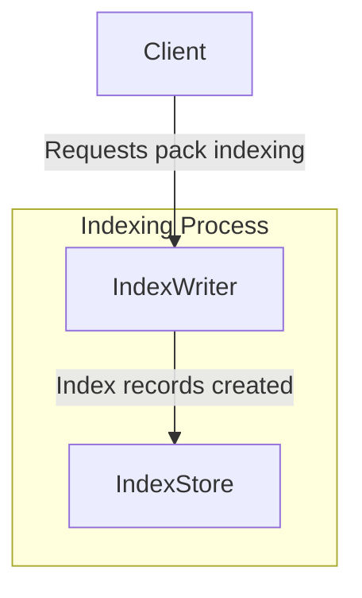

# Index writer specification


## Editors

- [Vasco Santos](https://github.com/vasco-santos)

## Authors

- [Vasco Santos](https://github.com/vasco-santos)

# Abstract

This document describes an indexing writer protocol that enables content-addressable data to be served efficiently by a server relying on the indexes written as described in this spec.

This writer spec complements the [Index spec](./index.md) by describing index creation and persistence. Reading and Writing are not required to be symmetrical, as long as the Index Stores knows how to interpret the persisted data format.

## Language

The key words "MUST", "MUST NOT", "REQUIRED", "SHALL", "SHALL NOT", "SHOULD", "SHOULD NOT", "RECOMMENDED", "MAY", and "OPTIONAL" in this document are to be interpreted as described in [RFC2119](https://datatracker.ietf.org/doc/html/rfc2119).

# Overview

Smart client implementations MAY request a verifiable pack as a single verifiable blob (e.g. RAW) or as a verifiable pack of blobs (e.g., CAR file). The server relies on indexes that enable it to handle requests efficiently. This specification cover the index writer primitives.

This specification defines an indexing system that MUST support different implementations:

- **Single-level index**: Maps a given blob multihash to the location where the server can read the bytes.
- **Multiple-level index**: Maps a containing multihash to the set of verifiable pack multihashes that compose it.

The choice of which indexing strategy to use depends on performance, cost, and use case requirements. Depending on the available clients, the content provider's setup, or the usage context of the content-addressable server, the content provider can decide which indexing system to use—or whether to use both.

### Single-level index

A Single-level index maps blob multihashes to the locations where the server can read the bytes of a given blob. An indexing strategy with these records enables fast responses for clients requesting verifiable blobs by their multihash. However, in some setups, implementing this indexing strategy may be prohibitively expensive (e.g., in databases like DynamoDB) or limited (e.g., due to rate limiting when indexing thousands of blobs in parallel from large packs). Furthermore, these indexes alone are insufficient to serve fully verifiable packs, as they do not maintain cryptographic relationships between blobs or packs.

### Multiple-level index

A Multiple-level index maps containing multihashes to a list of verifiable packs containing the blobs that form a given cryptographic relationship. This approach allows serving fully verifiable packs efficiently while reducing index store operations by several orders of magnitude. However, this index alone cannot serve single blob requests unless the request includes hints about a containing multihash.

### Type Comparison

| Feature                                             | single-level Index | multiple-level Index |
| --------------------------------------------------- | ------------------ | -------------------- |
| Supports single blob lookups by blob multihash only | ✅                 | ❌                   |
| Supports content retrieval by containing multihash  | ❌                 | ✅                   |
| Storage operations                                  | High               | Low                  |
| Lookup speed for a blob                             | Fast               | Slower               |
| Lookup speed for containing packs/blobs             | Slower             | Fast                 |

## Design Principles

The design of the indexing writer considers the following key aspects:

### Storage Efficiency & Cost Optimization:

- The protocol aims to minimize storage and retrieval costs by leveraging compact and structured index formats.
- Different backends (e.g., file-based, JSON, SQL, external CARv2 indexes) provide flexible storage options.

### Upgradability & Versioning:

- Index record schemas are versioned to allow future enhancements while maintaining compatibility.
- Future optimizations might include truncating stored multihashes to the last six characters, as the bytes can be validated by re-hashing.
- Indexes could store only byte ranges, rather than intermediary multihashes, requiring clients to provide metadata at request time on where they are at.

## System Design

### Index Record

Defined in [Index spec](./index.md).

### Index Store

```ts
import { MultihashDigest } from 'multiformats'

interface IndexStoreWriter {
  // Index entries stream to be added to the store
  add(entries: AsyncIterable<IndexRecord>): Promise<void>
}
```

### Index Writer Interface

The index MUST support putting new indexes with locations.

```ts
import { MultihashDigest } from 'multiformats'

interface BlobIndexRecord {
  // MultihashDigest identifiying the Blob
  multihash: MultihashDigest
  // hash digest of the location where the Blob is (Pack or Blob itself)
  location: MultihashDigest
  // length of the data
  length: number
  // offset of the data in the location byte stream
  offset: number
}

interface IndexWriter {
  // Stores indexed entries
  store: IndexStore

  // Adds blob indexes associated with a pack, optionally with a containing Multihash that has a relationship with the pack.
  addBlobs(
    blobIndexIterable: AsyncIterable<BlobIndexRecord>,
    // in a multi-level-index this can be used with the contaning Multihash from where this pack belongs
    // similar to https://github.com/ipfs/specs/pull/462
    options?: { contaningMultihash?: MultihashDigest }
  ): Promise<void>
}
```

### Record Persistence

To enable upgradability, index records MUST be stored with a versioning. Moreover, set of information associated with the record needs to be stored. Store implementations can store records according to what fits better, as long as they can construct the records as described in the schema below:

```ts
type IndexRecordEntry = Variant<{
  'index/blob@0.1': IndexRecord
  'index/containing@0.1': IndexRecord
}>

type IndexRecord = {
  // MultihashDigest identifiying the record
  multihash: MultihashDigest
  // Type of the record
  type: IndexRecordType
  // hash digest of the location or Path
  location: MultihashDigest
  // length of the data
  length?: number
  // offset of the data in the location byte stream
  offset?: number
  // associated records
  subRecords: Array<IndexRecord>
}
```

### External Indexing

An index store MAY rely on external indexes to be able to populate their records as defined above. For instance, they can have on the side `CARv2` like indexes and simply rely on the multihash of the pack to resolve them.

#### CARv2 Index Store

```ts
import { MultihashDigest } from 'multiformats'

interface CarV2IndexStore {
  loadIndex(packMultihash: MultihashDigest): CarV2Index | null
  storeIndex(packMultihash: MultihashDigest, index: CarV2Index): void
}
```

## Relationship Between Components

**Indexing New Content**

1. A client requests a given pack to be indexed. The Blobs within the Pack MAY have some cryptographic relationship identified by a Containing Multihash.
2. The IndexWriter creates the appropriate Index records to represent the multihashes.
3. The selected index is generated and stored in the Index Store.



## Implementation Guide

Different storage backends can be used to store these index formats while fulfilling the schema. The critical queries are determining where a given blob is stored (pack multihash and byte range) or locating all the packs/blobs that have a `containing` cryptographic relationship.

### Single-level Index Implementation

- **Filesystem-based store (path encoding):**
  - Example: `blob...5/index/blob@0.1/car..1/0-128`
  - **Advantages:**
    - Simple and cost-effective, no database required
    - A cloud based object storage can be used for scalability
  - **Tradeoffs:**
    - May be slower than a database query (e.g. DynamoDB), but likely not a bottleneck in most cases.
- **Encoded JSON-based store**
  - Example:
    ```json
    {
      "type": "index/blob@0.1",
      "data": {
        "multihash": "mh(blob..5)",
        "location": "mh(car..1)",
        "range": [0, 128]
      }
    }
    ```
  - **Advantages:**
    - Portable
    - Easy to store in key-value DBs keyed by blob multihash
  - **Tradeoffs:**
    - Parsing overhead
- **SQL-based index:**
  - **Advantages:**
    - Easy to storage.
  - **Tradeoffs:**
    - Requires composite keys given the blob MAY exist in multiple packs, increasing queries complexity and response times.
    - more expensive to operate

### Multiple-level index implementation guide

- **Linked CARv2 Indexes:**
  - Uses references to precomputed and stored CARv2 indexes externally stored. It should be keyed by containing multihash for querying.
  - Example:
    ```json
    {
      "index/containing@0.1": {
        "containing": "mh(bafy..dag)",
        "packs": ["mh(bag..left)", "mh(bag..right)"]
      }
    }
    ```
  - **Advantages:**
    - Efficient for streaming all packs combined as a trustless pack.
    - Only keeps minimal information optimizing for low index sizes.
    - Can re-use CARv2 indexes previously computed.
  - **Tradeoffs:**
    - Not efficient to use for querying for individual blobs, as individual external indexes need to be retrieved and parsed.
- **Embedded Slice Mapping in Index:**
  - Embeds blob locations directly in the index file. For instance, within a CAR file that encoded the index data. It should be keyed by containing multihash for querying.
  - Example:
    ```json
    {
      "index/containing@0.1": {
        "containing": "mh(bafy..dag)",
        "packs": ["mh(bag..left)"]
      },
      "mh(bag..left)": [
        ["blob..1", 0, 128],
        ["blob..2", 129, 256],
        ["blob..3", 257, 384],
        ["blob..4", 385, 51]
      ]
    }
    ```
  - **Advantages:**
    - Proven solution already deployed and used by Storacha.
    - Compatible indexes with the ones created by Storacha and tooling already available.
    - Efficient to find where a blob is stored when the containing multihash is also known.
    - Can work independently of CAR files.
  - **Tradeoffs:**
    - More costly to decode for bulk streaming.
    - More costly to store indexes if blob positions are irrelevant.
